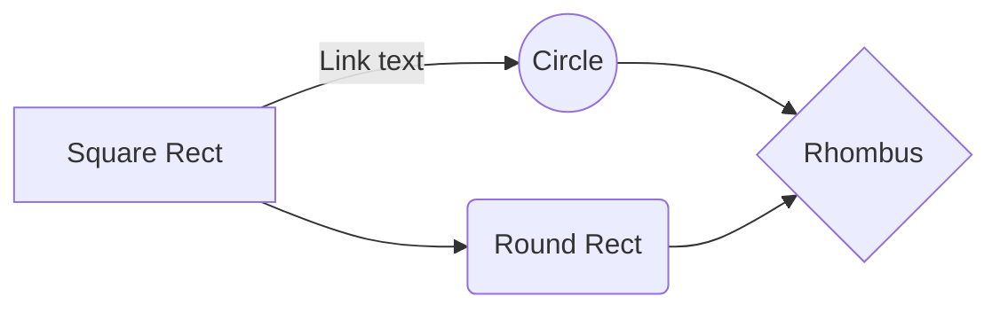
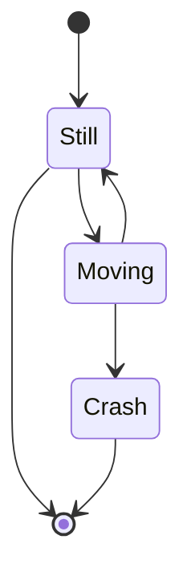

# bits_n_bobs
The minutiae of my computational stuff

## OS Things I learned

* To open things in vs code, use

```
code <filename>
```

* To see how the internet connection is doing, use

```
sudo iftop -B
```


## Different Test Suites
People have different preferences on their testing suites, so here are some
common ones.

### Pytest
* To run an existing test suite you can, from anywhere in the repo, type:
```
pytest
```

### Unittest
* To run an existing test suite you run:

```
python -m unittest path/to/test.py
```


## Accesibility
* Short Tol Colors (3 things): `mycolors = ["#332288", "#117733", "#AA4499"]`
* Med Tol Colors (4 things):  `mycolors = ["#332288", "#117733", "#44AA99", "#AA4499"]`
* Med Tol Colors (5 things):  `mycolors = ["#332288", "#117733", "#88CCEE", "#CC6677", "#AA4499"]`
* IBM Colors (5 things): `mycolors = ["#FFB000", "#648FFF", "#FE6100", "#785EF0", "#DC267F"]`
* Tol Colors (8 things): `mycolors = ["#332288", "#117733", "#44AA99", "#88CCEE", "#DDCC77", "#CC6677", "#AA4499", "#882255"]`


## UIUC HEX Codes
Urbana Orange: E84A27
U of I Blue: 13294b


## SSH
In you .ssh/config file you can save shortcuts to computers and
clusters in the form:

```
Host <name>
  Hostname <Address>
  User <username>
```

Instead of typing:

```
ssh <username>@<address>
```

To close out of an ssh session type: `~` and then `.`


## Default PATH Variable

If you mess up your path again, run this:
```
echo $PATH
```
And it should be empty because you deleted it, idiot. So, run this:
```
export PATH=$PATH="/home/nsryan/anaconda3/bin:/home/nsryan/anaconda3/condabin:/home/nsryan/.local/bin:/usr/local/sbin:/usr/local/bin:/usr/sbin:/usr/bin:/sbin:/bin:/usr/games:/usr/local/games:/snap/bin"
```
If you got rid of the temoa-py3 env PATH, run this:
```
export PATH=$PATH"/home/nsryan/anaconda3/envs/temoa-py3/bin:/home/nsryan/anaconda3/condabin:/home/nsryan/.local/bin:/usr/local/sbin:/usr/local/bin:/usr/sbin:/usr/bin:/sbin:/bin:/usr/games:/usr/local/games:/snap/bin"

```

## Grep
[Read more](https://www.freecodecamp.org/news/grep-command-in-linux-usage-options-and-syntax-examples/), but generally the vibe is you can search files and directories for instances from the command line.

```
grep '<thing you want to search>' <file you want to search>
```
## Flowcharts in Markdown
With [Mermaid](https://github.com/mermaid-js/mermaid-cli), you can make all manner of visuals in markdown or python.
```
:::mermaid
graph LR
A[Square Rect] -- Link text --> B((Circle))
A --> C(Round Rect)
B --> D{Rhombus}
C --> D
:::
```


```
:::mermaid
stateDiagram-v2
[*] --> Still
Still --> [*]
Still --> Moving
Moving --> Still
Moving --> Crash
Crash --> [*]
:::
```


